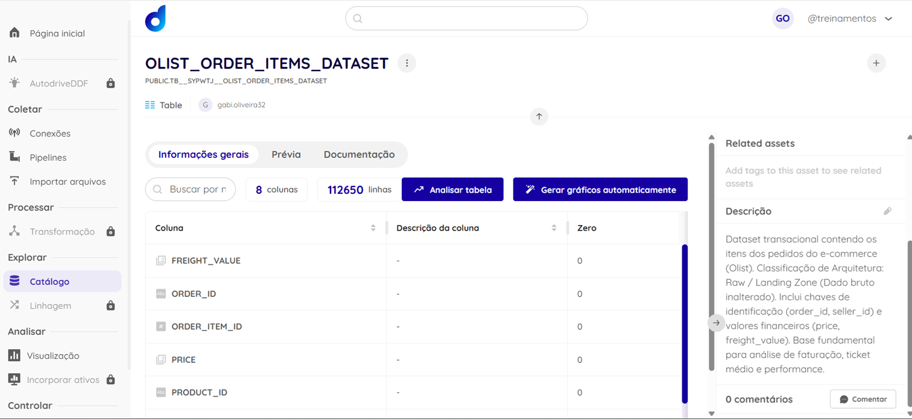

# Case Técnico - Plataforma de Dados Dadosfera

Este repositório contém a resolução do Case Técnico para a vaga de Estágio na Dadosfera. O projeto foi desenvolvido com foco na criação de uma infraestrutura mínima viável (MVP) de dados para uma grande operação de e-commerce, aplicando conceitos de gestão analítica, governança e qualidade de dados.

**Candidata:** Gabriela Oliveira  
**Curso:** Administração de Empresas  
**Data:** Julho de 2026  

---

## Item 2.1 - Sobre a Dadosfera - Integrar

Para a resolução do case, foi realizada a ingestão dos dados brutos na plataforma Dadosfera através do módulo de Coleta. O dataset selecionado foi o *"Brazilian E-Commerce Public Dataset by Olist"*, que simula o cenário real de uma grande operação de e-commerce. A carga foi concluída com sucesso, totalizando mais de 100.000 registos, atendendo ao requisito de volumetria para garantir a robustez das análises.



---

## Item 3 - Sobre a Dadosfera - Explorar

Após a ingestão, os dados foram devidamente catalogados seguindo as boas práticas de governança e organização de um Data Lake. O dataset foi classificado na arquitetura como pertencente à zona **Raw / Landing Zone**, visto tratar-se da extração bruta e inalterada dos dados. Foram também inseridas descrições com foco no negócio para facilitar o entendimento por parte dos gestores.

* **Descrição do Ativo:** *Dataset transacional contendo os itens dos pedidos do e-commerce (Olist). Classificação de Arquitetura: Raw / Landing Zone (Dado bruto inalterado). Inclui chaves de identificação (order_id, seller_id) e valores financeiros (price, freight_value). Base fundamental para análise de faturação, ticket médio e performance.*

🔗 [Link para o Catálogo do Dataset na Dadosfera](https://app.dadosfera.ai/pt-BR/catalog/data-assets/32b20117-ea38-4fed-adda-ad59df0e19f2)


---

## Item 4 - Sobre Data Quality

A garantia da qualidade dos dados é uma etapa crítica para a confiabilidade dos indicadores gerenciais. Utilizando a biblioteca `great-expectations` (versão estável `0.15.50`) em ambiente Python através do Google Colab, foi desenvolvido um script de validação focado em regras de negócio fundamentais:
1. **Validação de integridade:** Ausência de valores nulos nas chaves de identificação dos pedidos (`order_id`).
2. **Validação de Pipeline:** Garantia de que os preços praticados são maiores que zero (`price` > 0).

Os testes atestaram a integridade da base para consumo analítico, apresentando status de **[APROVADO]**. O ficheiro com o código-source (`.ipynb`) encontra-se anexado a este repositório.


---

## Item 7 - Sobre Análise de Dados - Analisar

Para extrair valor estratégico e apoiar a tomada de decisão gerencial, foi desenvolvido um Dashboard executivo no módulo de Visualização (Metabase) da Dadosfera. A coleção `Gabriela Oliveira - 07_2026` abriga as análises focadas em KPIs (Indicadores-Chave de Desempenho) de performance de e-commerce:

1. **Faturamento Total:** Indicador numérico de performance financeira geral (Total de 13.6M).
2. **Top Vendedores em Volume:** Tabela evidenciando a tração de vendas por parceiro comercial.
3. **Pedidos de Alto Ticket:** Rastreio das transações de maior valor agregado.
4. **Dispersão de Custos Logísticos:** Monitorização das maiores despesas de frete por pedido.
5. **Proporção Produto vs Frete:** Avaliação do peso do custo logístico sobre o valor da mercadoria.

**Exemplo de Query SQL utilizada (Top Vendedores):**
```sql
SELECT seller_id, COUNT(order_id) AS total_vendas 
FROM PUBLIC.TB__SYPWTJ__OLIST_ORDER_ITEMS_DATASET
GROUP BY seller_id 
ORDER BY total_vendas DESC 
LIMIT 5;
